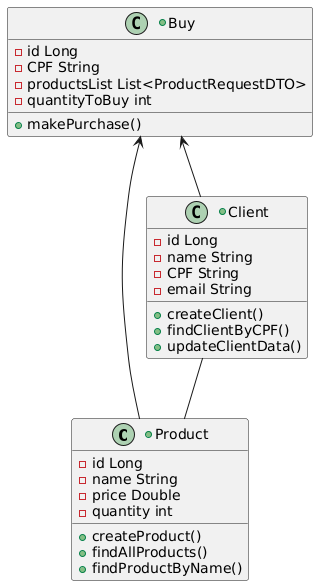

# SISTEMA DE E-COMMERCE


## Índice
1. [Descrição](#descrição)
2. [Explicação do funcionamento do código](#explicação-do-funcionamento-do-código)
3. [Execução](#execucao)
4. [Arquitetura do projeto](#arquitetura-do-projeto)
5. [Relações entre as Entidades](#relações-entre-as-entidades)
6. [Tecnologias utilizadas](#tecnologias-utilizadas)
7. [GitFlow](#gitflow)
8. [Commits](#commits)
9. [Próximos passos](#próximos-passos)


## Descrição

Esse é sistema básico de E-Commerce desenvolvido em Java utilizando o framework Spring Boot que permita o cadastro de produtos, clientes e a realização de compras. 
O objetivo é criar um sistema funcional que simule o funcionamento de uma loja virtual, com validações e manipulação de dados.


## Explicação do funcionamento do código

O sistema fornece uma API RESTful, onde é possível:

- Cadastrar produtos - com nomes únicos, preço maior que zero e quantidade maior ou igual a zero; 
- Acessar todos os produtos existentes ou acessar um produto específico pelo seu nome;
- Cadastrar clientes - com CPF e e-mail únicos;
- Atualizar dados de um cliente através do seu CPF;
- Acessar os dados de um cliente específico de um CPF;
- Realizar compras;
- Atualizar o estoque dos produtos;
- E comunicar se um produto está em falta no estoque - caso um produto esteja em falta, a compra de nenhum produto será realizada.


## Execução
1. Certifique-se de ter o Java 17 e o IntelliJ instalados em sua máquina, e o GitHub se desejar clonar o repositório.
2. Clone o repositório pelo GitHub utilizando o comando git clone git@github.com:nubiabarmoreira/Sistema-de-E-Commerce.git
3. Importe o projeto no IntelliJ.
4. Para executar o projeto basta rodar a classe `Main` ou o atalho Shift + F10. Também pode-se utilizar o comando no terminal `mvn spring-boot:run`
5. Acesse a API pelo Swagger para explorá-la na URL: http://localhost:8080/swagger-ui.html
6. Pode-se também acessar o console do banco de dados H2 pelo navegador na URL http://localhost:8080/h2-console, utilizando as seguintes credenciais para login:

- jdbc:h2:mem:ecommerce
- User Name: sa
- Password: password


## Arquitetura do projeto

O projeto segue a Arquitetura Hexagonal (Ports and Adapters), que promove a separação de responsabilidades e facilita a manutenção, testes e extensibilidade do sistema.

Abaixo está uma visão geral da estrutura do projeto, destacando as camadas e seus papéis:

```plaintext
src/
├── main/
│   ├── java/
│   │   ├── com/
│   │   │   │   ├── e_commerce/
│   │   │   │   │   ├── controllers/   # Classes para expor os endpoints
│   │   │   │   │   ├── dtos/          # Vão servir para realizar transferência de dados entre camadas da aplicação
│   │   │   │   │   ├── models/        # Entidades (Domínio)
│   │   │   │   │   ├── repositories/  # Classes relacionadas a camada que se comunica com as Entidades
│   │   │   │   │   ├── services/      # Classes onde agrupam as regras de négocio
│   ├── resources/                     # Configurações e arquivos estáticos
├── test/
```

## Relações entre as Entidades

O sistema possui três entidades principais: `Client`, `Product` e `Buy`. Abaixo estão as relações entre elas:

1. Client e Buy:
   - Um cliente pode realizar várias compras, mas cada compra pertence a apenas um cliente.
   - Relação: Um-para-Muitos (One-to-Many).

2. Product e Buy:
   - Uma compra pode conter vários produtos, e um produto pode estar presente em várias compras.
   - Relação: Muitos-para-Muitos (Many-to-Many).

3. Client e Product:
   - Não há uma relação direta entre cliente e produto, mas eles se conectam indiretamente por meio da compra (`Buy`).

Dessa forma, o diagrama de classes na Linguagem de Modelo Unificada (UML) fica da seguinte forma:




## Tecnologias utilizadas

As principais tecnologias e ferramentas utilizadas no desenvolvimento deste projeto são:

- Java 17
- Spring Boot 3.4.2
- Spring Validation
- Banco de Dados H2 - rodando em memória local para facilitar o desenvolvimento e os testes. Não é necessário configurar um banco de dados externo.
- JPA (Hibernate)
- Maven 
- Swagger - para documentação da API


## GitFlow

- A branch principal é a branch `main`
- Há uma branch secundária para desenvolvimento, a branch `develop`
- Para cada nova branch criada, há um padrão de `feature/`
- Após todos os códigos estarem na `develop` foi feito o merge para a branch `main`


## Commits

-  Foi utilizado coventional commits para manter um padrão de projeto, seguindo essa documentação:
   https://www.conventionalcommits.org/pt-br/v1.0.0/


## Próximos passos

- Melhorar as validações;
- Criar mais endpoints;
- Travar o sistema para que, caso um cliente tente comprar um produto sem estoque, retorne uma mensagem de erro, exiba quais produtos não estão disponíveis e impeça a compra de qualquer produto;
- Criar classes de Expections.